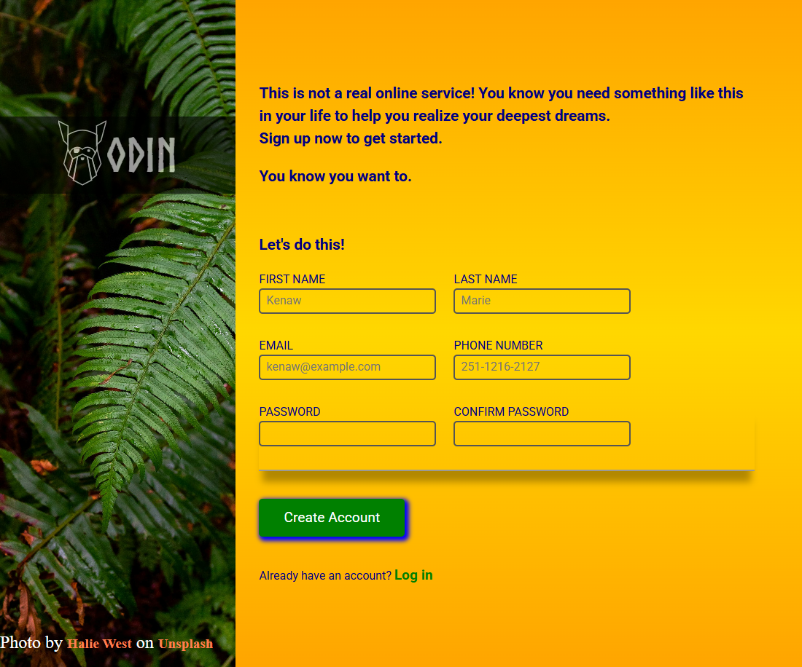

# The Odin Project - Sign-up Form solution

This is a solution to the [Sign-up Form project on The Odin Project](https://www.theodinproject.com/lessons/node-path-intermediate-html-and-css-sign-up-form). 

## Table of contents

- [Overview](#overview) 
  - [Screenshot](#screenshot)
  - [Links](#links)
- [My process](#my-process)
  - [Built with](#built-with)
  - [What I learned](#what-i-learned)  
- [Author](#author)
- [Acknowledgments](#acknowledgments)
 

## Overview

### Screenshot

 

### Links

- Solution URL: [Sign-up Form](https://github.com/KenawMarie/odin-Sign-up-Form)
- Live Site URL: [ live site ](https://kenawmarie.github.io/odin-Sign-up-Form/)

## My process

### Built with

- Semantic HTML5 markup
- svg
- form controls
- CSS font faces
- pseudo-elements
- positioning
- Flexbox 
- media queries

 

### What I learned

i learnt how to use custom webfont and pseudo elements.
 
 

## Author

- Website - [Github-Kenaw Marie](https://github.com/KenawMarie)
- The Odin Project - [@KenawMarie](https://www.theodinproject.com/dashboard) 
 

## Acknowledgments

 I wanna say thank you for The Odin project volunteers and contributors.